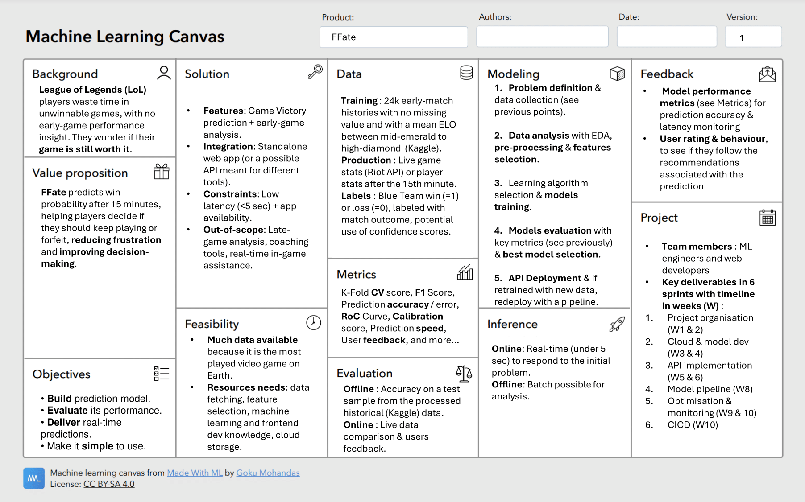

# Definition of FFate use case

## Completed template canevas

## Table conversion of the canevas

<table>
  <tr>
    <th>Background</th>
    <td>League of Legends (LoL) players waste time in unwinnable games, with no early-game performance insight. They wonder if their game is still worth it. </td>
  </tr>
  <tr>
    <th>Value proposition</th>
    <td>FFate predicts win probability after 15 minutes, helping players decide if they should keep playing or forfeit, reducing frustration and improving decisionmaking.
  </td>
  </tr>
  <tr>
    <th>Objectives</th>
    <td>

• Build prediction model.

• Evaluate its performance.

• Deliver real-time
predictions.

• Make it simple to use.
    </td>
  </tr>
  <tr>
    <th>Solution</th>
    <td>

• Features: Game Victory
prediction + early-game
analysis.

• Integration: Standalone
web app (or a possible
API meant for different
tools).

• Constraints: Low
latency (less than 5 sec) + app
availability.

• Out-of-scope: Lategame analysis, coaching
tools, real-time in-game
assistance. 
  </td>
  </tr>
  <tr>
    <th>Feasibility</th>
    <td>

• Much data available
because it is the most
played video game on
Earth.

• Resources needs: data
fetching, feature
selection, machine
learning and frontend
dev knowledge, cloud
storage.
  </td>
  </tr>
  <tr>
    <th>Data</th>
    <td>
    Training : 24k early-match
    histories with no missing
    value and with a mean ELO
    between mid-emerald to
    high-diamond (Kaggle).
    Production : Live game
    stats (Riot API) or player
    stats after the 15th minute.
    Labels : Blue Team win (=1)
    or loss (=0), labeled with
    match outcome, potential
    use of confidence scores.
    </td>
  </tr>
  <tr>
    <th>Metrics</th>
    <td>
    K-Fold CV score, F1 Score,
    Prediction accuracy / error,
    RoC Curve, Calibration
    score, Prediction speed,
    User feedback, and more…
    </td>
  </tr>
  <tr>
    <th>Evaluation</th>
    <td>
    Offline : Accuracy on a test
    sample from the processed
    historical (Kaggle) data.
    Online : Live data
    comparison& users
    feedback.
    </td>
  </tr>
  <tr>
    <th>Modeling</th>
    <td>

1. Problem definition & data collection (see previous points).

2. Data analysis with EDA, pre-processing & features selection.

3. Learning algorithm selection & models training.

4. Models evaluation with key metrics (see previously) & best model selection.

5. API Deployment & if retrained with new data, redeploy with a pipeline.

    </td>
  </tr>
  <tr>
    <th>Inference</th>
    <td>
    
Online: Real-time (under 5
sec) to respond to the initial
problem.
Offline: Batch possible for
analysis.

</td>
  </tr>
  <tr>
    <th>Feedback</th>
    <td>

- Model performance
metrics (see Metrics) for
prediction accuracy & latency
monitoring

- User rating & behaviour, to
see if they follow the
recommendations associated
with the prediction

    </td>
  </tr>
  <tr>
    <th>Project</th>
    <td>

Team members : ML
engineers and web
developers

Key deliverables in 6
sprints with timeline
in weeks (W) :

1. Project organisation
(W1 & 2)

2. Cloud & model dev
(W3 & 4)

3. API implementation
(W5 & 6)

4. Model pipeline (W8)

5. Optimisation &
monitoring (W9 & 10)

6. CICD (W10)
    </td>
  </tr>
</table>
