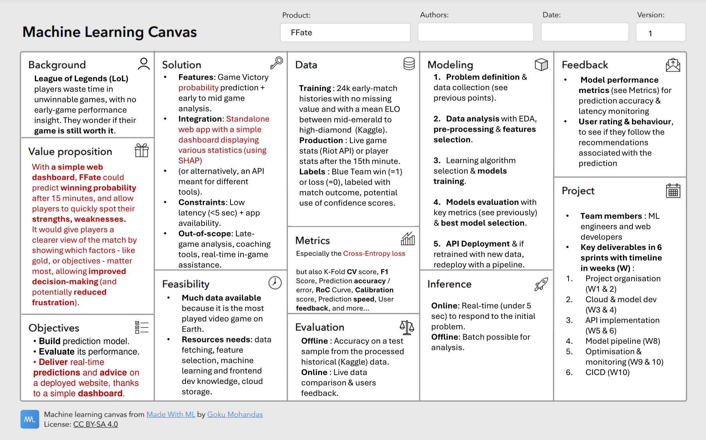

# Definition of FFate use case

## Improvements
During the Milestone 1 review, one of the feedbacks was that we **should give more information** to our product **value** and change it.

Instead of just showing who is going to win or loose, one of the highlighted idea was to create a **dashboard** for the user, in order to allow them to see their **probability of winning** and the **relevance of some features** and how much they contribute to that probability (with, for example, the help of SHAP).

As a result, we have **edited our Use Case canevas below**. All the **new** pieces of information which were edited are **highlighted in red**.

## Completed template canevas

